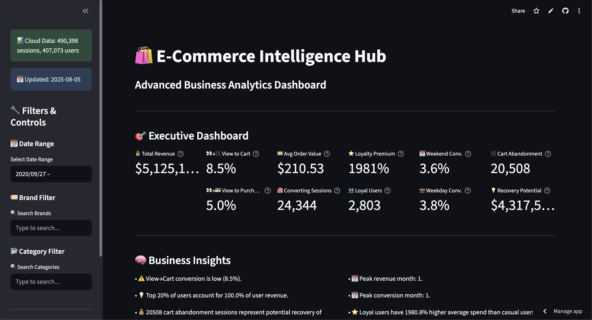
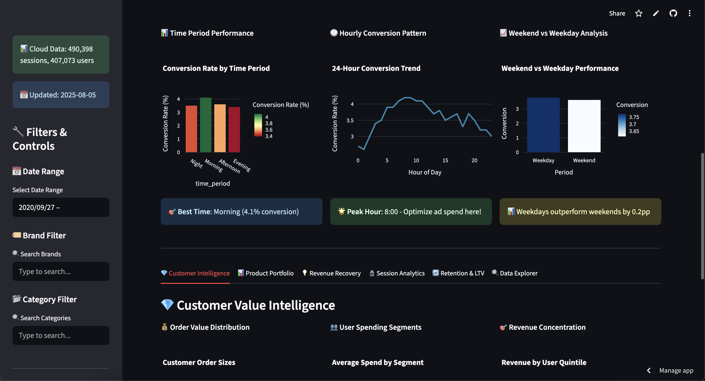
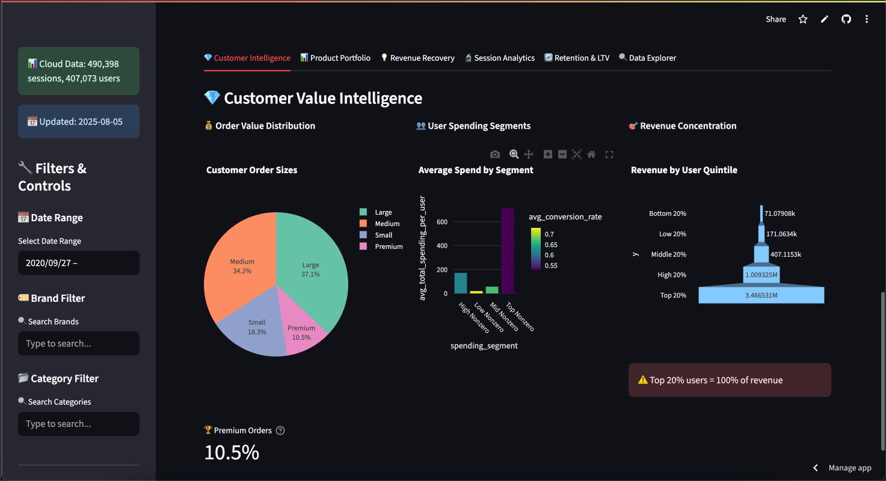

# E-Commerce Intelligence Hub 🛍️

A comprehensive e-commerce analytics platform that transforms raw transaction data into actionable business insights through advanced data processing, feature engineering, and interactive visualizations. Built for data analysts, business intelligence teams, and e-commerce professionals who need deep insights into customer behavior and business performance.

## 🚀 Key Features

### 📊 **Interactive Analytics Dashboard**
- **Executive KPIs**: Track revenue, conversion rates, customer metrics, and loyalty analysis
- **Advanced Filtering**: Real-time filtering by date range, brands, and product categories with Google-style search interface
- **Customer Intelligence**: Customer lifetime value segmentation, retention analysis, and revenue concentration insights
- **Product Portfolio Optimization**: Brand and category performance matrix with efficiency scoring
- **Revenue Recovery Center**: Cart abandonment analysis and customer loyalty upgrade opportunities
- **Temporal Analysis**: Time-of-day performance optimization and seasonal pattern identification

### 💾 **Robust Data Pipeline**
- **Automated Data Processing**: Complete ETL pipeline with data quality checks and preprocessing
- **Feature Engineering**: Generate session-level, user-level, brand-level, and category-level metrics
- **Business Intelligence Engine**: Advanced statistical analysis with automated insight generation
- **Professional Reporting**: Multi-sheet Excel exports with executive summaries and detailed analysis

### 🎯 **Business Intelligence Capabilities**
- Complete conversion funnel analysis (view → cart → purchase)
- Customer lifetime value (LTV) segmentation and retention metrics
- Brand and category performance efficiency scoring
- Session quality analysis and user behavior pattern recognition
- Revenue recovery opportunity identification and quantification
- Temporal optimization recommendations for marketing campaigns

### ☁️ **Cloud-Ready Architecture**
- **Cloud Deployment**: Optimized for Streamlit Cloud with pre-processed data packages
- **Performance Optimized**: Compressed data loading with intelligent caching
- **Scalable Design**: Handles large datasets with efficient memory management

## 📊 Screenshots & Demo

### Executive Dashboard

*Main dashboard showing key performance indicators and business metrics*

### Time Performance

*Time period performance, 24-hour conversion trend, weekend vs weekday*

### Customer Intelligence Analytics

*Customer segmentation, LTV analysis, and retention metrics*

## 📋 Requirements

- Python 3.8+
- 4GB+ RAM recommended for large datasets
- Modern web browser for dashboard access

## 🔧 Installation

### 1. Clone the Repository
```bash
git clone https://github.com/farukkamcici/e_comm_visual.git
cd e_comm_visual
```

### 2. Create Virtual Environment
```bash
python -m venv .venv
On Mac & Linux :source .venv/bin/activate  
On Windows: .venv\Scripts\activate
```

### 3. Install Dependencies
```bash
pip install -r requirements.txt
```

### 4. Get Dataset
Download the e-commerce events dataset and place it in `data/raw/events.csv`:

**Dataset Source**: [eCommerce Events History in Electronics Store](https://www.kaggle.com/datasets/mkechinov/ecommerce-events-history-in-electronics-store)
- **Provider**: [REES46 Marketing Platform](https://rees46.com/)
- **License**: Free to use with attribution
- **Format**: CSV with behavioral data from a electronics e-commerce store

**Required columns:**
- `user_id`: Unique user identifier
- `user_session`: Session identifier  
- `event_type`: Event type (view, cart, purchase)
- `product_id`: Product identifier
- `brand`: Product brand
- `category_code`: Product category
- `price`: Product price
- `event_time`: Timestamp of the event

**Download Instructions:**
1. Visit the [Kaggle dataset page](https://www.kaggle.com/datasets/mkechinov/ecommerce-events-history-in-electronics-store)
2. Download the CSV file
3. Place it as `data/raw/events.csv` in your project directory

## 🚀 Usage

### Local Development

#### Quick Start
```bash
# Run the complete analytics pipeline
python pipeline.py --tag $(date +%Y%m%d%H) --output outputs

# Launch the dashboard
streamlit run app.py
```

#### Detailed Pipeline Execution

**1. Data Processing Pipeline**
```bash
# Full pipeline with data cleaning and feature building
python pipeline.py --tag production_run --output outputs

# Skip data cleaning (if already clean)
python pipeline.py --skip-clean --tag feature_update --output outputs

# Skip feature building (if features exist)
python pipeline.py --skip-features --tag insights_only --output outputs
```

**2. Launch Interactive Dashboard**
```bash
streamlit run app.py
```
The dashboard will be available at `http://localhost:8501`


### 📈 Dashboard Navigation

#### **Main Sections:**
1. **🎯 Executive Dashboard**: High-level KPIs and performance metrics
2. **💎 Customer Intelligence**: Customer segmentation and value analysis
3. **📊 Product Portfolio**: Brand and category performance optimization
4. **💡 Revenue Recovery**: Opportunity identification and growth potential
5. **🔬 Session Analytics**: Advanced session behavior analysis
6. **🔄 Retention & LTV**: Customer lifetime value and retention metrics
7. **🔍 Data Explorer**: Interactive data exploration and search

#### **Export Features:**
- **📋 Comprehensive Excel Reports**: Multi-sheet reports with executive summaries, user analysis, session data, brand/category performance, temporal insights, and revenue recovery opportunities
- **Real-time Filtering**: All metrics update dynamically based on selected filters

## 📊 Sample Output

### Executive Dashboard Metrics
```
💰 Total Revenue: $2,435,891
👀→🛒 View to Cart: 15.3%
👀→💳 View to Purchase: 4.7%
💵 Avg Order Value: $89.45
⭐ Loyalty Premium: 340%
🛒 Cart Abandonment: 2,847 sessions
```

### Key Business Insights
- **Revenue Concentration**: Top 20% of users generate 68% of total revenue
- **Optimal Campaign Timing**: Peak conversion at 14:00-15:00 (3-4 PM)
- **Brand Efficiency**: Electronics brands show 2.3x higher conversion rates
- **Recovery Potential**: $486K potential revenue from cart abandonment recovery

## 🏗️ Project Structure

```
e_comm_visual/
├── app.py                      # Main Streamlit dashboard
├── pipeline.py                 # Data processing pipeline
├── cloud_data_loader.py        # Cloud data loading module
├── create_deployment_package.py # Cloud deployment package creator
├── requirements.txt            # Python dependencies
├── docs/
│   └── images/                # Screenshots for README documentation
├── data/
│   ├── raw/                   # Raw data files
│   ├── cleaned/               # Processed data
│   └── features/              # Feature engineered datasets
├── src/
│   ├── data/                  # Data cleaning modules
│   ├── features/              # Feature engineering
│   └── analysis/              # Business intelligence analysis
├── outputs/                   # Generated reports and summaries
└── deployment_package.pkl.gz  # Cloud deployment data package
```

### Key Files

- **`app.py`**: Main Streamlit dashboard with interactive analytics
- **`pipeline.py`**: Complete ETL pipeline for data processing
- **`cloud_data_loader.py`**: Optimized data loading for cloud deployment
- **`create_deployment_package.py`**: Creates compressed data packages for cloud deployment
- **`requirements.txt`**: All Python dependencies for local and cloud deployment

## 🔧 Configuration

### Environment Variables
```bash
# Optional: Override default data paths
export DATA_PATH="/path/to/your/data"
export OUTPUT_PATH="/path/to/outputs"
```

### Custom Thresholds
Modify constants in `src/analysis/analyze_insights.py`:
```python
LOYALTY_SESSION_CUTOFF = 5      # Sessions for loyal user classification
LOW_FUNNEL_ALERT_THRESHOLD = 0.1  # Conversion rate alert threshold
MAX_SESSION_DURATION_MINUTES = 120  # Session timeout threshold
```

## 📈 Performance & Scalability

- **Optimized Processing**: Efficient pandas operations with vectorized calculations
- **Memory Management**: Streaming data processing for large datasets
- **Caching**: Streamlit caching for improved dashboard performance
- **Timezone Handling**: Robust datetime processing with timezone awareness

## 🛠️ Troubleshooting

### Common Issues

**1. Memory Issues with Large Datasets**
```bash
# Process data in chunks or increase system memory
# Reduce date range in dashboard filters
```

**2. Missing Dependencies**
```bash
pip install --upgrade -r requirements.txt
```

**3. Data Format Issues**
```bash
# Ensure your CSV has the required columns
# Check date format compatibility (ISO 8601 recommended)
```

**4. Excel Export Errors**
```bash
# Ensure xlsxwriter is installed
pip install xlsxwriter>=3.0.0
```

## 🤝 Contributing

1. Fork the repository
2. Create a feature branch (`git checkout -b feature/amazing-feature`)
3. Commit your changes (`git commit -m 'Add amazing feature'`)
4. Push to the branch (`git push origin feature/amazing-feature`)
5. Open a Pull Request

## 📄 License

This project is licensed under the MIT License - see the LICENSE file for details.

## 🙏 Acknowledgments

**Dataset Attribution:**
- **Source**: [eCommerce Events History in Cosmetics Shop](https://www.kaggle.com/datasets/mkechinov/ecommerce-events-history-in-cosmetics-shop)
- **Provider**: [REES46 Marketing Platform](https://rees46.com/)
- **License**: Free to use with attribution

This project uses e-commerce behavioral data provided by REES46 Marketing Platform. The dataset contains real-world user interactions from an electronics e-commerce store, enabling comprehensive analytics and business intelligence demonstrations.

## 📞 Support

For questions, issues, or feature requests:
- Create an issue in the GitHub repository
- Review the troubleshooting section above
- Check the project documentation

---

**Built with ❤️ using Python, Streamlit, Plotly, and Pandas**

*Transform your e-commerce data into actionable business intelligence*